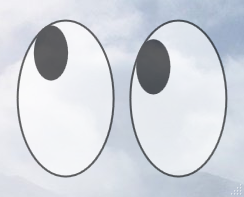

# 👀 ezXEyes

`ezXEyes` は、デスクトップ上に「xeyes」風の目を表示し、マウスカーソルの動きを追従する PowerShell ベースのマスコットアプリです。

---

## 📝 概要

- デスクトップ上に左右の目を表示
- 瞳がマウスカーソルをリアルタイムで追従
- Windows 環境で PowerShell だけで動作
- シンプルで軽量、常駐しても負荷が低い
- 実行用の `ezXEyes.vbs` を使うことで、PowerShell コンソールを表示せずにアプリを起動可能

---

## ✨ 特徴

- 完全 PowerShell 実装
- Canvas と WPF を使用した描画
- 単一インスタンスでの起動（重複起動を防止）
- カスタマイズ可能（目のサイズや位置など）

---

## 💻 動作環境

- Windows 10 / 11
- PowerShell 5.1 以上
- .NET Framework 4.7 以上

---

## 🚀 インストール

1. GitHub からリポジトリをクローン

```powershell
git clone https://github.com/ichiriki/ezXEyes.git
cd ezXEyes
```

2. スクリプトを実行

PowerShell コンソールを表示したくない場合:

```powershell
.\ezXEyes.vbs
```

直接 PowerShell で実行する場合:

```powershell
.\xeyes.ps1
```

> ※ スクリプト実行時にポップアップの警告が出る場合があります。信頼できるスクリプトとして実行してください。

---

## 📸 デモ



---

## ⚙️ オプション

- 現状は単純起動のみですが、将来的にウィンドウサイズや色などのカスタマイズオプションを追加予定です。

---

## ⚠️ 注意事項

- 常駐アプリですが、PowerShell コンソールを閉じると終了します
- 高 DPI 環境では表示サイズが若干異なる場合があります
- Windows のセキュリティポリシーにより、初回実行時に「実行許可」が必要な場合があります

---

## 📄 ライセンス

MIT License